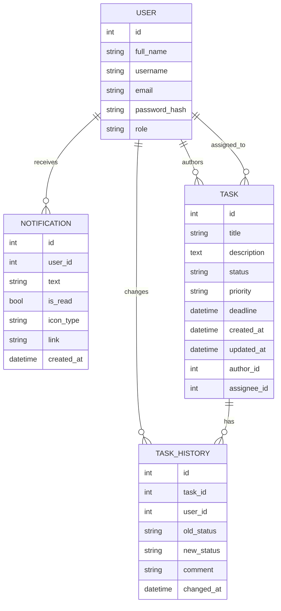

# TaskFlow

TaskFlow - это веб-информационная система для управления задачами внутри команды или небольшой организации. Система позволяет:

- регистрировать пользователей с ролями `manager` и `employee`;
- создавать и назначать задачи;
- отслеживать статус, приоритет, дедлайн и историю изменений;
- получать уведомления о назначении и изменении задач;
- смотреть аналитические отчеты по выполнению и загрузке сотрудников.

Проект реализован как Flask-приложение с PostgreSQL, серверным рендерингом HTML-шаблонов и небольшим слоем JavaScript для интерактивности дашборда.

## 1. Что это за ИС в целом

С точки зрения предметной области это система постановки и контроля задач.

Основная идея такая:

1. Пользователи регистрируются в системе.
2. Руководитель (`manager`) создает задачи.
3. Задачи назначаются исполнителям (`employee`).
4. По задаче можно менять статус, редактировать ее параметры и смотреть историю изменений.
5. Система автоматически считает просрочку по дедлайну.
6. При важных событиях создаются уведомления.
7. Руководитель получает отчеты по просрочке, выполнению и загрузке команды.

То есть система объединяет сразу несколько подсистем:

- аутентификация и авторизация;
- управление пользователями;
- управление задачами;
- аудит изменений задач;
- уведомления;
- аналитика и отчетность.

## 2. Архитектура проекта

Проект организован по модульному принципу через Flask Blueprints.

### Серверный слой

- `app.py` - точка входа приложения, создание `Flask`, подключение БД, настройка `Flask-Login`, регистрация всех Blueprint.
- `models.py` - модели БД и бизнес-сущности: `User`, `Task`, `TaskHistory`, `Notification`.
- `auth.py` - регистрация, вход, выход.
- `tasks.py` - основной бизнес-модуль: дашборд, список задач, карточка задачи, создание, редактирование, удаление, смена статуса.
- `notifications.py` - просмотр и отметка уведомлений как прочитанных.
- `reports.py` - отчеты для руководителя.

### Клиентский слой

- `templates/` - Jinja2-шаблоны HTML-страниц.
- `static/css/main.css` - визуальное оформление.
- `static/js/main.js` - небольшая клиентская логика: автоскрытие flash-сообщений, popover-фильтры, drag-and-drop статусов на Kanban-доске.

### Инфраструктура

- `Dockerfile` - сборка контейнера Flask-приложения.
- `docker-compose.yml` - запуск двух сервисов: `web` и `db`.
- `requirements.txt` - Python-зависимости.

## 3. Как проект запускается

### Вариант через Docker Compose

В проекте уже заложен основной способ запуска через контейнеры.

Команда:

```bash
docker compose up -d --build
```

Что происходит по шагам:

1. Docker Compose поднимает сервис `db` на базе `postgres:16-alpine`.
2. PostgreSQL создается с параметрами:
   - база: `taskflow`
   - пользователь: `taskflow`
   - пароль: `taskflow`
3. Затем собирается сервис `web` по `Dockerfile`.
4. В контейнер `web` копируется исходный код проекта и устанавливаются зависимости из `requirements.txt`.
5. Контейнер `web` запускает команду:

```bash
python app.py
```

6. В `app.py` создается Flask-приложение, инициализируются база и логин-менеджер, регистрируются маршруты.
7. При старте выполняется `db.create_all()`, поэтому таблицы создаются автоматически, если их еще нет.
8. Приложение начинает слушать порт `5000`.

### Кто кого запускает

Цепочка запуска такая:

```text
docker compose
  -> сервис db (PostgreSQL)
  -> сервис web
      -> python app.py
          -> Flask app
          -> SQLAlchemy
          -> Flask-Login
          -> Blueprints: auth, tasks, reports, notifications
          -> create_all() для таблиц
```

### Переменные окружения

Наиболее важные переменные:

- `DATABASE_URL` - строка подключения к БД.
- `SECRET_KEY` - ключ подписи сессий Flask.
- `PORT` - порт приложения.
- `FLASK_RUN_HOST` - адрес хоста.
- `FLASK_DEBUG` - режим отладки.

В `app.py` есть helper `_build_database_uri()`, который приводит разные варианты PostgreSQL URL к виду, подходящему для драйвера `psycopg`.

## 4. Главная точка входа: app.py

Файл `app.py` делает следующее:

1. Читает настройки окружения.
2. Создает объект `Flask`.
3. Настраивает `SQLALCHEMY_DATABASE_URI`.
4. Инициализирует `db` из `models.py`.
5. Настраивает `LoginManager`.
6. Объявляет `user_loader`, который по `user_id` достает пользователя из БД.
7. Подключает Blueprints:
   - `auth_bp`
   - `tasks_bp`
   - `reports_bp`
   - `notification_bp`
8. В контексте приложения вызывает `db.create_all()`.
9. Если файл запущен напрямую, стартует встроенный Flask-сервер.

Именно `app.py` является центральным узлом, который связывает все остальные модули в одно работающее приложение.

## 5. Модель данных и связи

Вся предметная область описана в `models.py`.

### 5.1. User

Сущность пользователя.

Основные поля:

- `id` - идентификатор;
- `full_name` - ФИО;
- `username` - логин;
- `email` - email;
- `password_hash` - хэш пароля;
- `role` - роль (`manager` или `employee`).

Поведение:

- `set_password(password)` - хэширует пароль;
- `check_password(password)` - проверяет пароль;
- `is_manager` - вычисляемое свойство, показывает, является ли пользователь руководителем.

Связи:

- у одного пользователя много уведомлений;
- пользователь может быть автором задачи;
- пользователь может быть исполнителем задачи;
- пользователь может фигурировать в истории изменений как тот, кто изменил задачу.

### 5.2. Task

Центральная сущность системы - задача.

Основные поля:

- `title` - название задачи;
- `description` - описание;
- `status` - статус (`new`, `in_progress`, `done`, `overdue`);
- `priority` - приоритет (`low`, `medium`, `high`, `critical`);
- `deadline` - срок исполнения;
- `created_at`, `updated_at` - технические даты;
- `author_id` - кто создал задачу;
- `assignee_id` - кому назначена задача.

Связи:

- `author` -> `User`;
- `assignee` -> `User`;
- `history` -> список записей `TaskHistory`.

Важная бизнес-логика:

- `effective_status` - вычисляет фактический статус задачи;
- если дедлайн уже прошел, а задача не закрыта, система трактует ее как `overdue`, даже если в БД формально сохранен другой статус;
- `is_overdue` - удобный флаг для отчетов и интерфейса;
- `status_label` и `priority_label` - человекочитаемые подписи для UI.

### 5.3. TaskHistory

Таблица аудита изменений задач.

Хранит:

- к какой задаче относится запись;
- кто сделал изменение;
- старый и новый статусы;
- комментарий;
- дату изменения.

Эта таблица нужна, чтобы в карточке задачи показывать историю событий.

### 5.4. Notification

Сущность уведомления.

Хранит:

- кому отправлено уведомление;
- текст уведомления;
- прочитано ли оно;
- тип иконки;
- ссылку, куда перейти;
- дату создания.

Уведомления используются как внутренняя система оповещений о событиях в задачах.

## 6. Схема связей между сущностями



## 7. Роли и права доступа

В системе две роли:

### `manager`

Руководитель может:

- видеть все задачи;
- создавать задачи;
- редактировать задачи;
- удалять задачи;
- смотреть все отчеты;
- фильтровать задачи по исполнителям;
- группировать Kanban по исполнителям.

### `employee`

Исполнитель может:

- видеть только свои задачи и задачи, где он автор;
- открывать карточку доступных ему задач;
- менять статус доступной задачи;
- смотреть собственные уведомления.

Контроль доступа реализован в основном в `tasks.py` и `reports.py`.

## 8. Какие модули за что отвечают

## 8.1. auth.py

Модуль аутентификации.

Маршруты:

- `/login` - вход;
- `/register` - регистрация;
- `/logout` - выход.

Логика:

- при регистрации создается новый `User`;
- пароль не хранится открыто, а хэшируется;
- при входе Flask-Login создает пользовательскую сессию;
- если пользователь уже авторизован, повторно на форму входа/регистрации его не отправляют.

## 8.2. tasks.py

Это главный бизнес-модуль всей системы.

Маршруты:

- `/` и `/dashboard` - Kanban-дашборд;
- `/tasks` - табличный список задач;
- `/tasks/new` - создание задачи;
- `/tasks/<id>` - карточка задачи;
- `/tasks/<id>/edit` - редактирование;
- `/tasks/<id>/status` - смена статуса;
- `/tasks/<id>/delete` - удаление.

Внутренняя логика модуля:

- `_employee_query()` - получает список исполнителей;
- `_task_query_for_current_user()` - строит базовый запрос к задачам в зависимости от роли;
- `_can_access_task(task)` - проверяет, может ли текущий пользователь открыть конкретную задачу;
- `_create_notification(...)` - создает уведомление;
- `_overdue_filter()` - фильтр для просроченных задач.

Именно этот модуль связывает вместе задачи, историю, уведомления, ролевую модель и UI-страницы.

## 8.3. reports.py

Модуль отчетности.

Доступен только руководителю.

Маршруты:

- `/reports` - стартовая страница раздела отчетов;
- `/reports/workload` - загруженность сотрудников;
- `/reports/done` - выполненные задачи;
- `/reports/overdue` - просроченные задачи.

Отчеты работают только на чтение, ничего не изменяют в БД.

## 8.4. notifications.py

Модуль уведомлений.

Маршруты:

- `/notifications` - список уведомлений текущего пользователя;
- `/notifications/<notif_id>/read` - пометить одно уведомление как прочитанное;
- `/notifications/read_all` - пометить все непрочитанные уведомления как прочитанные.

Этот модуль изолирован от основного бизнес-процесса, но наполняется данными из `tasks.py`.

## 9. Как устроен интерфейс

### `base.html`

Базовый шаблон после входа в систему.

Содержит:

- левое меню;
- отображение текущего пользователя;
- индикатор количества непрочитанных уведомлений;
- общий layout для всех внутренних страниц;
- вывод flash-сообщений.

Все основные страницы после авторизации наследуются от этого шаблона.

### Страницы авторизации

- `login.html` - форма входа;
- `register.html` - форма регистрации.

Они не используют `base.html`, потому что это отдельный публичный сценарий до входа в систему.

### Страницы задач

- `dashboard.html` - Kanban-доска;
- `tasks.html` - список задач в таблице;
- `task_form.html` - форма создания/редактирования;
- `task_detail.html` - карточка задачи и история изменений.

### Страницы отчетов

- `reports.html` - меню выбора отчета;
- `report_workload.html` - загруженность сотрудников;
- `report_done.html` - выполненные задачи;
- `report_overdue.html` - просроченные задачи.

### Страница уведомлений

- `notifications.html` - просмотр и отметка уведомлений.

## 10. Как работает основной жизненный цикл системы

Ниже описаны ключевые бизнес-потоки.

### 10.1. Регистрация пользователя

1. Пользователь открывает `/register`.
2. Заполняет ФИО, логин, email, пароль, роль.
3. `auth.py` проверяет уникальность `username` и `email`.
4. Создается объект `User`.
5. Пароль хэшируется через `set_password()`.
6. Пользователь сохраняется в БД.
7. После этого происходит переход на страницу логина.

### 10.2. Вход в систему

1. Пользователь открывает `/login`.
2. Вводит логин и пароль.
3. Система ищет пользователя по `username`.
4. Пароль проверяется через `check_password()`.
5. Если проверка успешна, вызывается `login_user(user)`.
6. Flask-Login сохраняет сессию.
7. Пользователь попадает на дашборд.

### 10.3. Создание задачи

1. Руководитель открывает `/tasks/new`.
2. Заполняет название, описание, приоритет, дедлайн, исполнителя.
3. Создается объект `Task`.
4. В `author_id` записывается текущий руководитель.
5. В `assignee_id` записывается выбранный исполнитель.
6. После `flush()` задача уже получает `id`.
7. Создается запись `TaskHistory` с комментарием `Задача создана`.
8. Если исполнитель назначен, создается `Notification`.
9. Все изменения фиксируются через `commit()`.
10. Пользователь перенаправляется в карточку задачи.

### 10.4. Редактирование задачи

1. Руководитель открывает `/tasks/<id>/edit`.
2. Меняет поля задачи.
3. Система проверяет уникальность названия.
4. Поля `Task` обновляются.
5. В `TaskHistory` добавляется запись `Параметры задачи обновлены`.
6. Если сменился исполнитель, новому исполнителю создается уведомление.
7. Данные сохраняются в БД.

### 10.5. Изменение статуса задачи

Статус можно менять двумя способами:

- через форму в карточке задачи;
- перетаскиванием карточки по колонкам на Kanban-доске.

Серверный поток одинаковый:

1. Запрос идет на `/tasks/<id>/status`.
2. Система проверяет доступ к задаче.
3. Новый статус сравнивается с текущим.
4. Если статус изменился, у `Task` обновляется поле `status`.
5. В `TaskHistory` создается запись со старым и новым статусом.
6. Второй стороне процесса отправляется уведомление:
   - если менял исполнитель, уведомляется автор;
   - если менял автор, уведомляется исполнитель.
7. Изменения сохраняются через `commit()`.

### 10.6. Автоматическая логика просрочки

Отдельного фонового планировщика здесь нет.

Просрочка вычисляется на лету:

- если дедлайн истек;
- и задача не имеет статус `done`;
- тогда для интерфейса и отчетов она считается `overdue`.

Это реализовано через свойства `effective_status` и `is_overdue`.

То есть система не обязательно физически переписывает статус в БД, но отображает задачу как просроченную там, где это нужно.

### 10.7. Уведомления

Уведомления появляются в двух основных случаях:

- назначение задачи исполнителю;
- изменение статуса задачи.

Потом пользователь:

- видит счетчик непрочитанных уведомлений в боковом меню и в кнопке-колокольчике;
- открывает страницу `/notifications`;
- может прочитать одно уведомление или отметить все как прочитанные.

### 10.8. Отчеты

Отчеты доступны только руководителю.

#### Отчет по просроченным задачам

Показывает задачи, у которых:

- либо статус уже `overdue`;
- либо дедлайн истек, а статус не `done`.

#### Отчет по выполненным задачам

Показывает задачи со статусом `done`.

Дополнительно поддерживает фильтр по датам через `updated_at`.

#### Отчет по загруженности сотрудников

Для каждого исполнителя считается:

- сколько всего задач;
- сколько новых;
- сколько в работе;
- сколько завершенных;
- сколько просроченных.

## 11. Как связан backend и frontend

В проекте серверный рендеринг, поэтому основная логика идет так:

1. Браузер отправляет HTTP-запрос.
2. Flask-маршрут получает запрос.
3. Модуль обращается к SQLAlchemy-моделям.
4. Формируются данные.
5. Вызывается `render_template(...)`.
6. Jinja2 подставляет данные в HTML.
7. Готовая страница возвращается в браузер.

JavaScript используется точечно:

- автоматическое скрытие flash-сообщений;
- popover-фильтры на дашборде;
- drag-and-drop карточек по статусам;
- отправка запроса на смену статуса через `fetch()` без ручного заполнения формы.

То есть здесь нет SPA-фронтенда на React/Vue. Это классическое серверное веб-приложение на Flask с небольшими клиентскими улучшениями.

## 12. Пример полного сценария в системе

Пример сквозного процесса:

1. Руководитель регистрируется или входит в систему.
2. Руководитель создает задачу и назначает исполнителя.
3. В БД создаются:
   - запись `Task`;
   - запись `TaskHistory`;
   - запись `Notification` для исполнителя.
4. Исполнитель входит в систему и видит задачу на дашборде и в списке задач.
5. Исполнитель открывает карточку задачи и переводит ее в `in_progress`.
6. В БД появляется новая запись `TaskHistory`.
7. Руководителю создается уведомление о смене статуса.
8. После завершения работы исполнитель или руководитель переводит задачу в `done`.
9. Задача начинает попадать в отчет по выполненным задачам.
10. Если задача не закрыта вовремя, она начинает отображаться как просроченная и попадает в отчет по просрочке.

## 13. Основные технические зависимости

В `requirements.txt` используются:

- `Flask` - веб-фреймворк;
- `Flask-SQLAlchemy` - ORM и работа с БД;
- `Flask-Login` - сессии и авторизация;
- `psycopg[binary]` - драйвер PostgreSQL;
- `Werkzeug` - служебные функции Flask, включая хэширование паролей.

## 14. Сильные стороны текущей реализации

В проекте уже есть хорошие архитектурные решения:

- разделение по модулям и зонам ответственности;
- четкое разделение ролей `manager` и `employee`;
- история изменений задач;
- уведомления как отдельная сущность;
- серверная логика фильтрации и группировки задач;
- вычисляемая просрочка без обязательного фонового обновления записей;
- контейнеризация через Docker Compose.

## 15. Что важно понимать про текущую реализацию

Некоторые особенности проекта:

- БД создается автоматически через `db.create_all()`, то есть миграции пока не используются.
- Просрочка вычисляется динамически, а не через отдельный cron/job.
- Интерфейс в основном серверный, без отдельного frontend-приложения.
- Большая часть бизнес-логики сосредоточена в маршрутах Flask, а не вынесена в отдельный service layer.

Для учебного проекта, дипломной работы или небольшой внутренней системы такой подход вполне рабочий и понятный.

## 16. Краткий итог

TaskFlow - это ролевая система управления задачами с Kanban-дашбордом, табличным списком задач, карточками задач, историей изменений, уведомлениями и отчетами.

Центр всей системы - это связка:

- `app.py` как точка сборки приложения;
- `models.py` как описание предметной области;
- `tasks.py` как основной бизнес-процесс;
- `auth.py`, `notifications.py`, `reports.py` как дополнительные функциональные модули;
- `templates/` и `static/` как пользовательский интерфейс;
- `docker-compose.yml` и `Dockerfile` как инфраструктура запуска.

Если смотреть на проект как на целостную ИС, то его логика строится вокруг жизненного цикла задачи: создание -> назначение -> выполнение -> контроль сроков -> фиксация истории -> уведомление участников -> аналитика для руководителя.